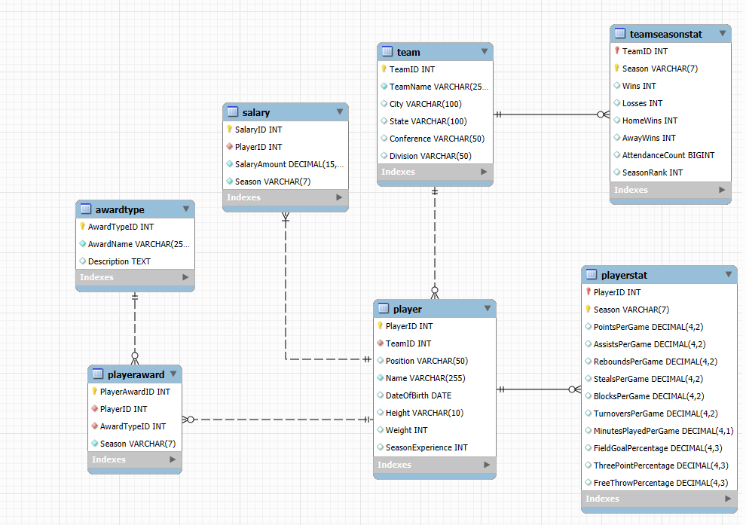
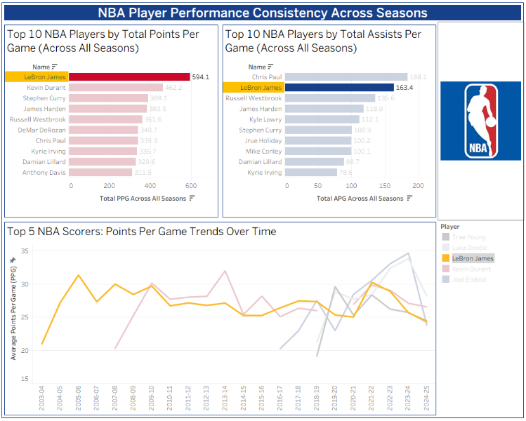
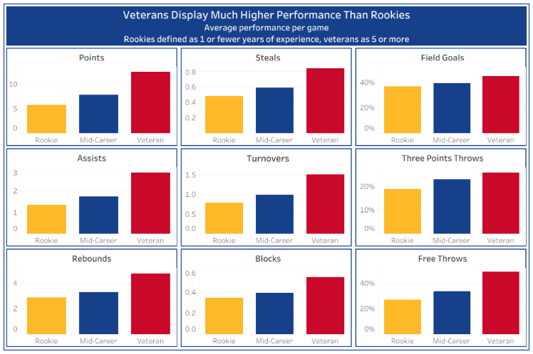
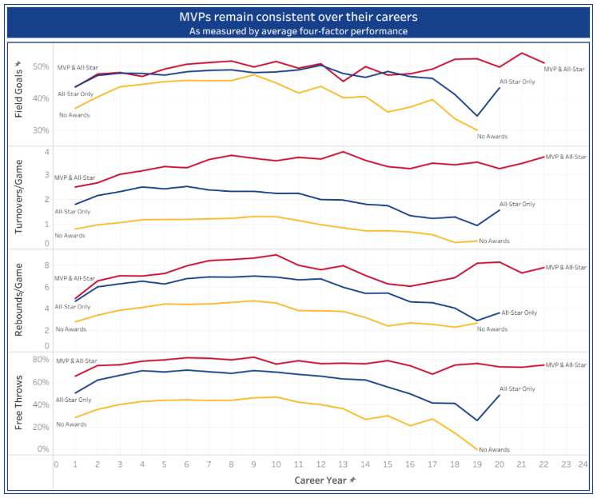
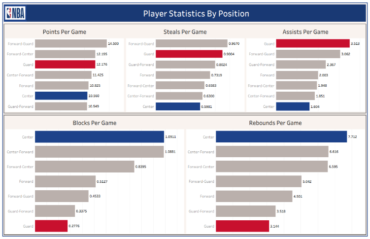
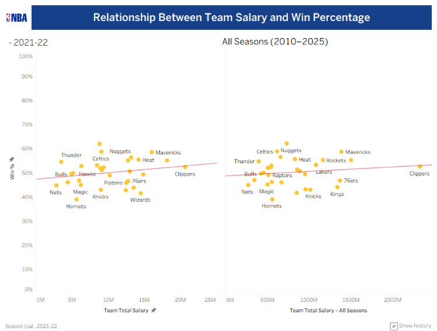
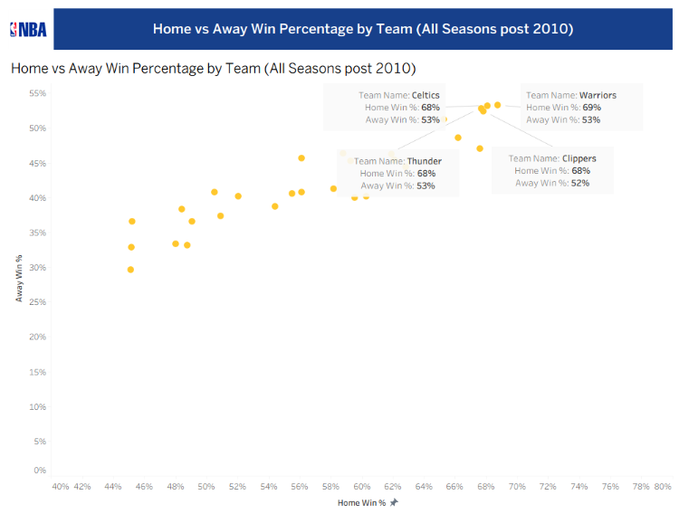
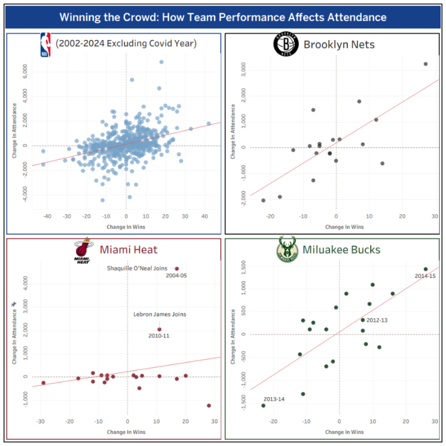

  

# NBA Performance Analytics — Database-Driven Visualization Framework

A full analytics workflow built by a group of NBA fans who wanted to dig into 25 years of league data and actually answer the debates we kept having. We pulled data from multiple sources, built a relational database, and visualized everything in Tableau.

---

## Highlights

- Built a **Python ETL pipeline** ingesting data from the **NBA API**, **ESPN's public API**, and **web scraping** (BeautifulSoup), consolidating 4 data sources across 25 seasons
- Designed a **normalized MySQL relational database** with 6 tables and proper foreign key relationships across players, teams, salaries, stats, and awards
- Explored **7 questions** through Tableau dashboards covering player consistency, salary vs wins, rookie vs veteran gaps, and what actually drives attendance

---

## Tech Stack

- **Data:** NBA API (Python), ESPN public API, BeautifulSoup web scraping
- **Database:** MySQL, MySQL Workbench
- **ETL:** Python (Pandas, Requests, BeautifulSoup)
- **Visualization:** Tableau

---

## Database Design

### Entity-Relationship Model

The schema centers on a `player` table linked to:
- `playerstat` — per-season game averages
- `playeraward` — MVP and All-Star awards via `awardtype`
- `salary` — annual salary per player per season
- `team` — current team assignment
- `teamseasonstat` — team-level wins, losses, attendance, and rankings per season

### ETL Pipeline

All data was pulled and loaded through a fully automated Python ETL pipeline that:
1. Pulled player lists, season averages, and awards from the NBA API
2. Scraped historical attendance and salary data from ESPN
3. Standardized team names across franchise relocations and historical name changes
4. Generated and executed SQL INSERT statements to populate all tables

---

## What We Explored

### 1. Who has actually been the most consistent player over the years?

Not surprising — LeBron leads all players in total points per game across seasons (594.1) and ranks second in assists. KD, Steph, Harden, and Westbrook round out the top 5. The line chart makes it pretty clear who has just been *on* for two decades straight.

---

### 2. Are rookies actually that bad compared to veterans?

Yes. Veterans (5+ seasons) outperform rookies by up to **2x across every single metric** including points, assists, rebounds, steals, blocks, and shooting percentages. Rookies really do have a lot to prove.

---

### 3. Can you tell early on who is going to be an MVP?

Pretty much. MVP-caliber players show significantly higher performance **from their very first season** and stay consistent throughout their career. Meanwhile everyone else peaks and declines. Turnovers and free throw percentage turn out to be surprisingly strong early signals.

---

### 4. Does your position actually determine your stats?

Yep. Guards lead in points (12.2 PPG), assists (3.5 APG), and steals (0.90 SPG). Centers clean up the glass with 7.7 rebounds and 1.09 blocks per game. Nothing groundbreaking but the numbers are fun to look at.

---

### 5. Does spending more money actually get you more wins?

Kind of, but not as much as you would think. There is a positive trend but it is pretty flat. The Clippers have spent the most money all-time and have pretty average win rates to show for it. Efficiency matters more than the check size.

---

### 6. Which teams are just as dangerous on the road as at home?

The Warriors, Celtics, Thunder, and Clippers stand out, all winning around 68-69% at home and 52-53% away across all post-2010 seasons. Everyone else leans pretty heavily on home court.

---

### 7. Do fans actually show up more when their team gets better?

Yes and the Miami Heat panel is the most fun one to look at. Their attendance barely moves with wins and losses, but the moment Shaq or LeBron walks through the door it spikes. Market-sensitive teams like the Nets and Bucks show a much tighter win-attendance relationship.

